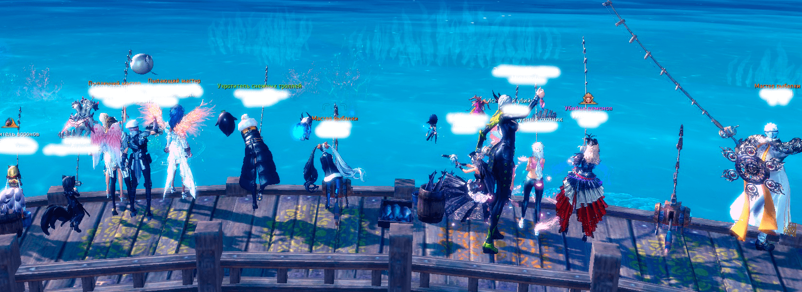

    

<h3 align="center">fishing_bot_bns</h3>

 fishing bot from game Blade and Soul 

## How use:

1. Download and install AHK (https://www.autohotkey.com/);
2. Launch BNS and go to the fishing spot;
3. Put the bait in cell number 7;
4. Run the main.ahk file with administrator privileges;
5. Activate bait and press F11. As a result, the script should display a message "Script is run".
6. To stop the script, press F12.
